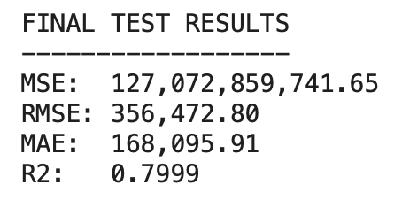
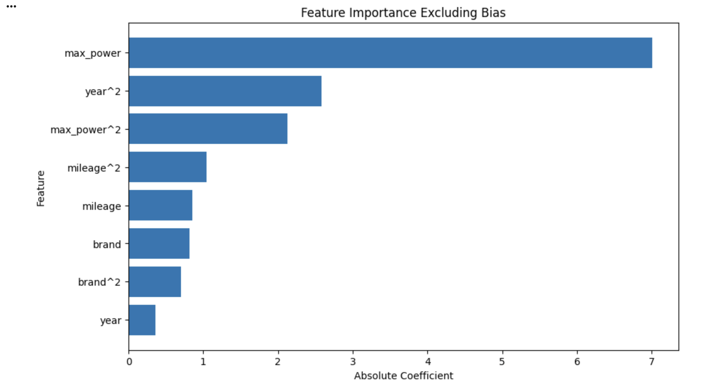
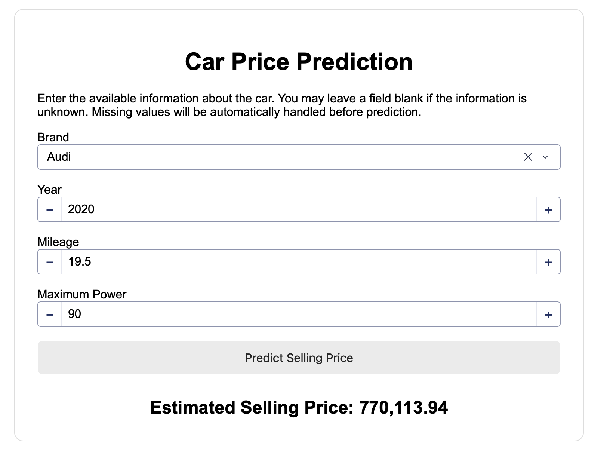
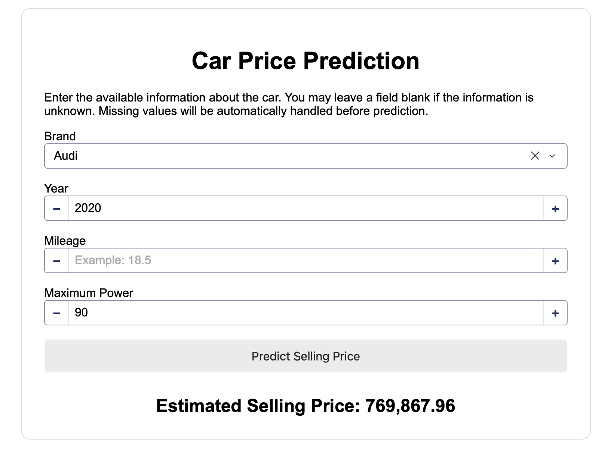

# Car Price Prediction

## AT82.03 Machine Learning — Assignment 1

This project develops a machine learning system for predicting the selling price of used cars. It covers the complete machine learning workflow including data preparation, exploratory data analysis, preprocessing, model experimentation, evaluation, inference, and deployment through a Dash web application.

---

## Project Overview

The goal of this project is to build a web-based car price prediction system. Users can enter information about a vehicle and receive an estimated selling price generated by the trained machine learning model.

The project consists of three main parts:

1. **Data preparation and machine learning**
2. **Model evaluation and analysis**
3. **Deployment using Dash and Docker**

---

## Dataset

The project uses the `Cars.csv` dataset.

The original dataset contains the following features:

* name
* year
* selling_price
* km_driven
* fuel
* seller_type
* transmission
* owner
* mileage
* engine
* max_power
* torque
* seats

---

## Data Preparation

The dataset was cleaned and prepared according to the assignment requirements.

The main preprocessing steps included:

* Mapping owner categories to numerical values
* Removing Test Drive Cars
* Removing CNG and LPG vehicles because they use a different mileage measurement system
* Removing `kmpl` from mileage and converting it to numerical format
* Removing `CC` from engine and converting it to numerical format
* Cleaning and converting maximum power to numerical format
* Extracting the first word of the car name as the brand
* Dropping the `torque` feature
* Encoding categorical features
* Handling missing values using imputation
* Checking possible outliers using the IQR method
* Scaling the selected model features
* Applying a logarithmic transformation to `selling_price`

The target variable was transformed using:

```python
y = np.log(df['selling_price'])
```

During inference, predictions were converted back to the original price scale using:

```python
pred_price = np.exp(pred_log)
```

---

## Exploratory Data Analysis

EDA was performed to understand:

* Selling price distribution
* Vehicle year and selling price
* Maximum power and selling price
* Mileage and selling price
* Engine size and selling price
* Kilometers driven and selling price
* Feature correlations
* Possible outliers

The original selling-price distribution was strongly right-skewed, which supported the use of a logarithmic transformation.

---

## Selected Features

The final model uses four features:

* `max_power`
* `mileage`
* `year`
* `brand`

These features were selected based on exploratory analysis, correlations, and model experimentation.

---

## Model Experiments

The following regression approaches were compared:

* Normal Linear Regression
* Ridge Regression
* Lasso Regression
* Elastic Net Regression

### Initial Model Comparison

| Model                    | Average MSE | Average R² |
| ------------------------ | ----------: | ---------: |
| Normal Linear Regression |      0.1202 |     0.8289 |
| Lasso Regression         |      0.1346 |     0.8082 |
| Elastic Net Regression   |      0.1734 |     0.7529 |
| Ridge Regression         |      0.3479 |     0.5043 |

Normal Linear Regression achieved the best cross-validation performance and was selected for further experimentation.

---

## Hyperparameter Experiments

The following settings were tested:

* Different learning rates
* Batch, mini-batch, and stochastic gradient descent
* Xavier and zero weight initialization
* Momentum enabled and disabled
* First- and second-degree polynomial features

### Final Configuration

The best model configuration was:

| Parameter         | Selected Value              |
| ----------------- | --------------------------- |
| Regression        | Normal Linear Regression    |
| Learning Rate     | 0.01                        |
| Optimization      | Stochastic Gradient Descent |
| Initialization    | Zero                        |
| Momentum          | False                       |
| Polynomial Degree | 2                           |

---

## Final Model Performance

The final model was evaluated using the previously unseen test dataset.

| Metric |                 Result |
| ------ | ---------------------: |
| R²     |             **0.7999** |
| MAE    |         **168,095.91** |
| RMSE   |         **356,472.80** |
| MSE    | **127,072,859,741.65** |

The R² score of approximately `0.80` indicates that the model explains around 80% of the variation in car selling prices in the test dataset.

The RMSE is higher than the MAE, suggesting that a smaller number of vehicles produced relatively large prediction errors.

### Final Test Output



---

## Feature Importance

The final polynomial model showed the following combined feature importance:

| Feature       | Combined Importance |
| ------------- | ------------------: |
| Maximum Power |          **9.1383** |
| Year          |          **2.9405** |
| Mileage       |          **1.8999** |
| Brand         |          **1.5213** |

Maximum power was the most influential feature in the final model, followed by vehicle year.



---

## Web Application

A web-based interface was developed using **Dash by Plotly**.

Users can enter:

- Car brand
- Year
- Mileage
- Maximum power

The application then predicts the estimated selling price of the car.

If the user does not know one of the values, the field can be left blank. Missing inputs are automatically handled using the imputation values calculated from the training data.

### Example 1: Prediction with all input values provided

In this example, all fields are filled and the model returns an estimated selling price.



### Example 2: Prediction with one missing value

In this example, the `Mileage` field is left blank. The application still returns a prediction by automatically handling the missing value before inference.



---

## Running the Application with Docker

### Prerequisites

Make sure Docker is installed and running.

### 1. Clone the repository

```bash
git clone <YOUR-GITHUB-REPOSITORY-URL>
```

Move into the project:

```bash
cd Car_Price_Project
```

### 2. Navigate to the application folder

```bash
cd app
```

### 3. Build and run the application

```bash
docker compose up --build
```

Docker will build the required image and start the Dash application.

### 4. Open the application

Open the following address in a browser:

```text
http://localhost:8050
```

### 5. Stop the application

Press:

```text
Ctrl + C
```

Then remove the running container with:

```bash
docker compose down
```

---

## Running Without Docker

The application can also be run directly using Python.

Navigate to:

```bash
cd app/code
```

Install the dependencies:

```bash
pip install -r requirements.txt
```

Run:

```bash
python app.py
```

Then open:

```text
http://localhost:8050
```

---

## Project Structure

```text
Car_Price_Project/
│
├── A1_Predicting_Car_Price_126671.ipynb
├── Cars.csv
├── README.md
├── .gitignore
│
├── images/
│   ├── app_prediction.png
│   ├── final_model_results.png
│   └── feature_importance.png
│
└── app/
    ├── Dockerfile
    ├── docker-compose.yaml
    │
    └── code/
        ├── app.py
        ├── requirements.txt
        │
        └── model/
            ├── model_data.pkl
            ├── scaler.pkl
            ├── brand_encoder.pkl
            └── imputation_values.pkl
```

---

## Technologies Used

* Python
* NumPy
* Pandas
* Matplotlib
* Seaborn
* Scikit-learn
* MLflow
* Dash
* Docker
* Gunicorn

---

## Author

**Student ID:** 126671
**Name:** Dakchhyeta Bade Shrestha
